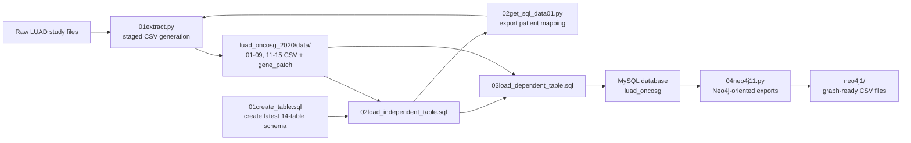

<div align="center">

<h1>database_mutation</h1>

**A staged Python + MySQL pipeline for turning LUAD clinical, mutation, and expression files into a normalized relational database and Neo4j-ready CSV exports.**

`Python` `MySQL` `SQL` `pandas` `PyMySQL` `Bioinformatics` `Neo4j export`

</div>

## Overview

This project transforms the **LUAD (OncoSG, 2020)** study files into a reusable mutation database. The latest code path:

- cleans and stages the raw study files with `01extract.py`
- loads the curated CSV outputs into MySQL with `01create_table.sql`, `02load_independent_table.sql`, and `03load_dependent_table.sql`
- exports graph-friendly CSV files with `04neo4j11.py`

The current schema has **14 tables** and uses a separate `gene_mutation` bridge table. Treatment flags now live on `admission`, so if you still see a standalone `treatment` table in older files, that is from an earlier version of the project.

## Current State Of The Repo

Use these files as the source of truth for the latest workflow:

- `01extract.py`
- `02get_sql_data01.py`
- `01create_table.sql`
- `02load_independent_table.sql`
- `03load_dependent_table.sql`
- `04neo4j11.py`

Important repo-history note:

- `01extract.py` now generates `15gene_mutation_table.csv`
- `03load_dependent_table.sql` now loads `gene_mutation`
- `04neo4j11.py` now expects `gene_mutation` and exports `gene_mutation.csv`
- the committed dump `luad_oncosg.sql` still reflects the older treatment-based schema and does **not** match the latest SQL scripts

If two artifacts disagree, trust the numbered root `.py` and `.sql` files first.

## Pipeline At A Glance



## Visual Diagrams


## Repository Layout

| Path | Purpose |
| --- | --- |
| Root numbered `.py` and `.sql` files | Canonical entry points for the latest workflow |
| [`scripts/`](scripts) | Mirror copies of the main Python scripts plus a small helper shell script |
| [`sql/`](sql) | Mirror copies of the main SQL files and dump files |
| [`diagram/`](diagram) | ER and Neo4j image assets |
| [`luad_oncosg_2020/`](luad_oncosg_2020) | Source study files, staged CSV outputs, mapping exports, and notes |
| [`luad_oncosg_2020/data/`](luad_oncosg_2020/data) | Generated CSV files used for MySQL import |
| [`luad_oncosg_2020/data/data_from_sql/`](luad_oncosg_2020/data/data_from_sql) | Mapping files exported back out of MySQL |
| [`neo4j1/`](neo4j1) | Graph-oriented CSV exports |
| [`ERmodel`](ERmodel) | Historical text ER draft; useful for context, but not the latest source of truth |
| [QuickDBD ER model](https://app.quickdatabasediagrams.com/#/d/fbdRB0) | Online ER model used during schema design |

## Data Source

The metadata in `luad_oncosg_2020/useless_files/meta_study.txt` identifies the source as:

- **Study:** Lung Adenocarcinoma (OncoSG, Nat Genet 2020)
- **Study ID:** `luad_oncosg_2020`
- **Cancer type:** LUAD
- **PMID:** `32015526`
- **Description:** Whole-exome and transcriptome sequencing of **305** East Asian lung adenocarcinomas with matched normals

Main committed raw inputs:

- `luad_oncosg_2020/[done]data_clinical_patient.txt`
- `luad_oncosg_2020/[done]data_clinical_sample.txt`
- `luad_oncosg_2020/[done]data_mutations.txt`
- `luad_oncosg_2020/[done]data_mrna_seq_v2_rsem_zscores_ref_all_samples.txt`

## Requirements

You need:

- Python 3
- MySQL
- `pandas`
- `PyMySQL`

Example setup:

```bash
python3 -m venv .venv
source .venv/bin/activate
pip install pandas PyMySQL
```

For MySQL local file loading, you may also need:

```sql
SET GLOBAL local_infile = 1;
```

and a client started with `--local-infile=1`.

## Before You Run Anything

The runnable scripts contain hard-coded local paths and placeholder credentials copied from the original development environment. Update them before rerunning the pipeline:

- `01extract.py`
- `02get_sql_data01.py`
- `04neo4j11.py`
- `02load_independent_table.sql`
- `03load_dependent_table.sql`

Paths currently look like:

```text
/Users/liulin/Desktop/database/project/...
```

Replace them with your own absolute path to this repository.

Also inspect the reset block at the top of `01create_table.sql` before running it against a non-empty database.

## Recommended Quick Path: Rebuild From The Committed CSV Files

If you want a database that matches the **latest code and schema**, use the committed staged CSV outputs rather than the dump.

### Run Order

1. Update the hard-coded file paths in `02load_independent_table.sql` and `03load_dependent_table.sql`.
2. Create the target database `luad_oncosg`.
3. Run `01create_table.sql`.
4. Run `02load_independent_table.sql`.
5. Run `03load_dependent_table.sql`.
6. Optionally run `04neo4j11.py` to regenerate the Neo4j exports.

Example MySQL session:

```sql
CREATE DATABASE IF NOT EXISTS luad_oncosg;
USE luad_oncosg;
SOURCE /absolute/path/to/database_mutation/01create_table.sql;
SOURCE /absolute/path/to/database_mutation/02load_independent_table.sql;
SOURCE /absolute/path/to/database_mutation/03load_dependent_table.sql;
```

## Full Staged Rebuild From The Raw Study Files

`01extract.py` is stateful: it needs MySQL-generated IDs from earlier load steps before it can finish later tables. The clean rebuild is therefore staged.

### Run Order

1. Update paths and credentials in the Python and SQL files listed above.
2. Create the database `luad_oncosg`.
3. Run `01create_table.sql` to create the latest schema.
4. Run `python 01extract.py` once.
   This first pass generates the early CSV files such as `01patient_table.csv` through `06consequence_table.csv`.
5. Run `02load_independent_table.sql`.
   This loads `patient`, `cancer_type`, `cancer_subtype`, `sample_type`, `gene`, and `consequence`.
6. Run `python 02get_sql_data01.py`.
   This exports `luad_oncosg_2020/data/data_from_sql/01patient_mapping.csv`.
7. Run `python 01extract.py` again.
   This second pass can generate `07admission_table.csv` and `08sample_table.csv`.
8. In `03load_dependent_table.sql`, run only the first two `LOAD DATA` blocks for `admission` and `sample`.
9. Run `python 01extract.py` a third time.
   This final pass can generate the remaining files, including `09score_table.csv`, `11mutation_table.csv`, `12sample_mutation_table.csv`, `13mutation_annotation_table.csv`, `14gene_sample_table.csv`, `15gene_mutation_table.csv`, and `gene_patch.csv`.
10. Run the rest of `03load_dependent_table.sql`.
    The current load order covers `score`, `mutations`, `gene_mutation`, `sample_mutation`, `mutation_annotation`, the `gene_patch.csv` append into `gene`, and `gene_sample`.
11. Optionally run `python 04neo4j11.py`.

## Legacy Shortcut: Restore The Committed SQL Dump

The repository also includes:

- [`luad_oncosg.sql`](luad_oncosg.sql)
- [`sql/luad_oncosg.sql`](sql/luad_oncosg.sql)

These dump files are **legacy snapshots**. They restore an older 14-table design that still includes a standalone `treatment` table and does not include `gene_mutation`.

Use the dump only if you explicitly want that older snapshot. If you want the database to match the latest extractor and load scripts, use the CSV rebuild path instead.

Example restore:

```bash
mysql -u root -p -e "CREATE DATABASE IF NOT EXISTS luad_oncosg;"
mysql -u root -p luad_oncosg < /absolute/path/to/database_mutation/luad_oncosg.sql
```

Compatibility warning:

- the latest `04neo4j11.py` expects `gene_mutation`
- the legacy dump does not create `gene_mutation`
- if you restore only the dump, regenerate graph exports only after confirming schema compatibility

## Current Schema

The latest root SQL scripts define these **14 tables**:

- `patient`
- `cancer_type`
- `cancer_subtype`
- `sample_type`
- `admission`
- `sample`
- `score`
- `gene`
- `gene_sample`
- `mutations`
- `gene_mutation`
- `consequence`
- `mutation_annotation`
- `sample_mutation`

Key model change versus older artifacts:

- no standalone `treatment` table in the latest schema
- treatment flags are stored on `admission`
- `mutations` no longer carries `gene_id` directly
- the gene-to-mutation relationship now lives in `gene_mutation`

## Committed Output Scale

Based on the latest committed staged outputs, the project currently works at roughly this scale:

| Output | Rows |
| --- | ---: |
| `01patient_table.csv` | 305 |
| `07admission_table.csv` | 305 |
| `08sample_table.csv` | 305 |
| `09score_table.csv` | 305 |
| `05gene_table.csv` | 18,625 |
| `11mutation_table.csv` | 72,650 |
| `15gene_mutation_table.csv` | 71,101 |
| `12sample_mutation_table.csv` | 71,832 |
| `13mutation_annotation_table.csv` | 76,186 |
| `14gene_sample_table.csv` | 3,174,158 |

`gene_patch.csv` may be empty if the current `gene` table already covers all expression-file symbols.

## Expected Neo4j Export Outputs

When regenerated with the latest `04neo4j11.py`, `neo4j1/` should contain files such as:

- `patient.csv`
- `admission.csv`
- `sample.csv`
- `gene.csv`
- `mutation.csv`
- `gene_mutation.csv`
- `sample_mutation.csv`
- `sample_big_table.csv`
- `mutation_big_table.csv`

## Historical Artifacts To Be Aware Of

Some files in the repository belong to the older treatment-based version and are useful as references, but not as the latest runnable truth:

- `luad_oncosg.sql`
- `sql/luad_oncosg.sql`
- `10treatment_table.csv`
- `ERmodel`
- older generated files already inside `neo4j1/`

In the current root-script workflow:

- `10treatment_table.csv` is not loaded by `03load_dependent_table.sql`
- `02case_mapping.csv` is not required by the latest `01extract.py`
- `01create_table.sql` is the authoritative schema definition
