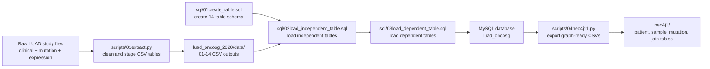

# database_mutation

<div align="center">

**A staged Python + MySQL pipeline for turning LUAD mutation, clinical, and expression files into a normalized relational database and Neo4j-ready CSV exports.**

`Python` `MySQL` `SQL` `pandas` `Bioinformatics` `Neo4j export`

</div>

## Project Summary

This project transforms the **LUAD (OncoSG, 2020)** study files into a structured mutation database. It cleans clinical, sample, mutation, and expression data with Python, loads the curated results into a normalized MySQL schema with 14 related tables, and then exports graph-friendly CSV files for downstream Neo4j use. The repository already includes both the raw study inputs and the generated intermediate CSV tables, so you can either reproduce the pipeline step by step or take the faster route and import the committed outputs directly.

## Topics Used

| Topic | How it is used here |
| --- | --- |
| Python | Data cleaning, reshaping, ID mapping, and export logic |
| MySQL | Normalized target database for the final relational model |
| SQL | Schema creation and staged `LOAD DATA LOCAL INFILE` import |
| pandas | Parsing, merging, deduplication, and wide-to-long transforms |
| Bioinformatics | Mutation, consequence, sample, and gene-expression integration |
| Neo4j | Optional graph-oriented CSV export after MySQL load |

## Pipeline At A Glance



## Repository Layout

| Path | Purpose |
| --- | --- |
| [`scripts/`](scripts) | Preferred home for the numbered Python pipeline scripts |
| [`sql/`](sql) | Preferred home for the numbered SQL schema/load scripts |
| [`luad_oncosg_2020/`](luad_oncosg_2020) | Source study files, generated staging CSVs, notes, and reference metadata |
| [`luad_oncosg_2020/data/`](luad_oncosg_2020/data) | Generated CSV tables used for MySQL import |
| [`luad_oncosg_2020/data/data_from_sql/`](luad_oncosg_2020/data/data_from_sql) | Mapping files exported from MySQL auto-increment keys |
| [`luad_oncosg_2020/useless_files/`](luad_oncosg_2020/useless_files) | Original source files kept for reference but skipped in the main pipeline |
| [`neo4j1/`](neo4j1) | Graph-oriented CSV exports and denormalized join outputs |
| [`ERmodel`](ERmodel) | Plain-text entity relationship model for the relational design |
| [`luad_oncosg_2020/log.md`](luad_oncosg_2020/log.md) | Working notes about the source file fields and study content |
| Root numbered files | Duplicates of the organized copies in `scripts/` and `sql/` |

## Data Source Summary

The dataset metadata in [`luad_oncosg_2020/useless_files/meta_study.txt`](luad_oncosg_2020/useless_files/meta_study.txt) identifies the source as:

- **Study:** Lung Adenocarcinoma (OncoSG, Nat Genet 2020)
- **Study ID:** `luad_oncosg_2020`
- **Cancer type:** LUAD
- **Citation:** Chen et al. *Nature Genetics* (2020)
- **PMID:** `32015526`
- **Description:** Whole-exome and transcriptome sequencing of **305** East Asian lung adenocarcinomas with matched normals

The main raw inputs committed in this repository are:

- [`luad_oncosg_2020/[done]data_clinical_patient.txt`](luad_oncosg_2020/%5Bdone%5Ddata_clinical_patient.txt)
- [`luad_oncosg_2020/[done]data_clinical_sample.txt`](luad_oncosg_2020/%5Bdone%5Ddata_clinical_sample.txt)
- [`luad_oncosg_2020/[done]data_mutations.txt`](luad_oncosg_2020/%5Bdone%5Ddata_mutations.txt)
- [`luad_oncosg_2020/[done]data_mrna_seq_v2_rsem_zscores_ref_all_samples.txt`](luad_oncosg_2020/%5Bdone%5Ddata_mrna_seq_v2_rsem_zscores_ref_all_samples.txt)

## Setup Requirements

### Software

- Python 3.10+ recommended
- MySQL 8.x recommended
- Optional: Neo4j, if you want to use the graph export files downstream

### Python Dependencies

The scripts import:

- `pandas`
- `PyMySQL`

Example setup:

```bash
python3 -m venv .venv
source .venv/bin/activate
pip install pandas PyMySQL
```

### Important Local Edits Before Running

This repository contains **hard-coded local paths** and **placeholder database credentials** copied from the original development environment. Before rerunning the pipeline, update these values in the Python and SQL files:

- `scripts/01extract.py`
- `scripts/02get_sql_data01.py`
- `scripts/03get_sql_data02.py`
- `scripts/04neo4j11.py`
- `sql/02load_independent_table.sql`
- `sql/03load_dependent_table.sql`

You will need to replace paths such as:

```text
/Users/liulin/Desktop/database/project/...
```

with your own local absolute path to this repository.

For MySQL local file loading, you may also need:

```sql
SET GLOBAL local_infile = 1;
```

and a client session started with `--local-infile=1`.

## Fastest Path: Import The Committed CSV Outputs

If your goal is to get the database working quickly, you do **not** need to regenerate all CSV files. The repository already includes the staged outputs under [`luad_oncosg_2020/data/`](luad_oncosg_2020/data).

### Exact Run Order

1. Update all `LOAD DATA LOCAL INFILE` paths in [`sql/02load_independent_table.sql`](sql/02load_independent_table.sql) and [`sql/03load_dependent_table.sql`](sql/03load_dependent_table.sql).
2. Create the target database `luad_oncosg`.
3. Run [`sql/01create_table.sql`](sql/01create_table.sql).
4. Run [`sql/02load_independent_table.sql`](sql/02load_independent_table.sql).
5. Run [`sql/03load_dependent_table.sql`](sql/03load_dependent_table.sql).
6. Optionally run [`scripts/04neo4j11.py`](scripts/04neo4j11.py) to regenerate the Neo4j export folder.

Example MySQL session:

```sql
CREATE DATABASE IF NOT EXISTS luad_oncosg;
USE luad_oncosg;
SOURCE /absolute/path/to/database_mutation/sql/01create_table.sql;
SOURCE /absolute/path/to/database_mutation/sql/02load_independent_table.sql;
SOURCE /absolute/path/to/database_mutation/sql/03load_dependent_table.sql;
```

## Full Rebuild From The Raw Study Files

The project can also be rerun from the original text files, but the extraction logic is **stateful**: `scripts/01extract.py` depends on mappings that only exist after some tables have already been loaded into MySQL. Because of that, the clean rebuild is staged.

### Exact Run Order

1. Update the hard-coded paths and MySQL credentials in all relevant Python and SQL files.
2. Create the database `luad_oncosg`.
3. Run [`sql/01create_table.sql`](sql/01create_table.sql) to create the empty schema.
4. Run `python scripts/01extract.py` once.
   This first pass generates the early CSV tables such as `01patient_table.csv` through `06consequence_table.csv`. If the script stops when it reaches the missing patient-mapping stage, that is expected for this rebuild path.
5. Run [`sql/02load_independent_table.sql`](sql/02load_independent_table.sql) to load `patient`, `cancer_type`, `cancer_subtype`, `sample_type`, `gene`, and `consequence`.
6. Run `python scripts/02get_sql_data01.py` to export [`luad_oncosg_2020/data/data_from_sql/01patient_mapping.csv`](luad_oncosg_2020/data/data_from_sql/01patient_mapping.csv).
7. Run `python scripts/01extract.py` again.
   This second pass can now generate `07admission_table.csv` and `08sample_table.csv` using the patient ID mapping. If it later stops because downstream sample IDs are not yet loaded into MySQL, continue with the next staged SQL load step.
8. Execute only the `admission` and `sample` load sections from [`sql/03load_dependent_table.sql`](sql/03load_dependent_table.sql).
9. Run `python scripts/01extract.py` a third time.
   This final staged pass can generate `09score_table.csv` through `14gene_sample_table.csv`, plus `gene_patch.csv`, because the necessary auto-generated IDs now exist in MySQL.
10. Execute the remaining sections of [`sql/03load_dependent_table.sql`](sql/03load_dependent_table.sql) to load `score`, `treatment`, `mutations`, `sample_mutation`, `mutation_annotation`, `gene_patch`, and `gene_sample`.
11. Optionally run `python scripts/04neo4j11.py` to export the graph-oriented CSVs into [`neo4j1/`](neo4j1).

### About `scripts/03get_sql_data02.py`

[`scripts/03get_sql_data02.py`](scripts/03get_sql_data02.py) exports a `case_id` mapping CSV, but the current version of `scripts/01extract.py` no longer depends on that file directly. It looks like a legacy helper from an earlier workflow, so treat it as optional unless you want the extra mapping artifact for debugging or documentation.

## How To Import Or Use The SQL Dump

This repository does **not** currently ship a single full `mysqldump` file. Instead, it uses:

- [`sql/01create_table.sql`](sql/01create_table.sql) for schema creation
- [`sql/02load_independent_table.sql`](sql/02load_independent_table.sql) for independent tables
- [`sql/03load_dependent_table.sql`](sql/03load_dependent_table.sql) for dependent tables

If you want a reusable one-file dump **after** loading the database, you can create your own:

```bash
mysqldump -u root -p --databases luad_oncosg > luad_oncosg_dump.sql
```

and later restore it with:

```bash
mysql -u root -p < luad_oncosg_dump.sql
```

## Schema, Documentation, And Presentation Assets

- Schema / ER model: [`ERmodel`](ERmodel)
- Data notes / documentation write-up: [`luad_oncosg_2020/log.md`](luad_oncosg_2020/log.md)
- SQL schema and load scripts: [`sql/`](sql)
- Presentation: **no slide deck or presentation file is currently committed in this repository**

## Expected End Result

After a successful import, you should have a MySQL database named `luad_oncosg` with **14 tables**:

- `patient`
- `cancer_type`
- `cancer_subtype`
- `sample_type`
- `admission`
- `treatment`
- `sample`
- `score`
- `gene`
- `gene_sample`
- `mutations`
- `consequence`
- `mutation_annotation`
- `sample_mutation`

Based on the committed CSV outputs in this repository, the loaded data should be on roughly the following scale:

| Output | Approximate row count |
| --- | ---: |
| `patient` | 305 |
| `admission` | 305 |
| `sample` | 305 |
| `score` | 305 |
| `treatment` | 305 |
| `gene` | 18,625 before patch load |
| `mutations` | 72,650 |
| `sample_mutation` | 71,832 |
| `mutation_annotation` | 76,186 |
| `gene_sample` | 3,174,158 |

If you also run the Neo4j export step, [`neo4j1/`](neo4j1) should contain files such as:

- `patient.csv`
- `admission.csv`
- `sample.csv`
- `gene.csv`
- `mutation.csv`
- `sample_mutation.csv`
- `sample_big_table.csv`
- `mutation_big_table.csv`

Quick verification queries:

```sql
SHOW TABLES;
SELECT COUNT(*) FROM patient;
SELECT COUNT(*) FROM sample;
SELECT COUNT(*) FROM mutations;
SELECT COUNT(*) FROM gene_sample;
```

## Notes

- The organized `scripts/` and `sql/` directories are the recommended entry points.
- The numbered files at the repository root are identical copies kept for convenience.
- Several scripts were clearly developed iteratively, so a staged rerun is expected when reproducing the pipeline from raw data.
- The committed intermediate CSVs make the repository much easier to reuse than to fully rebuild from scratch.
